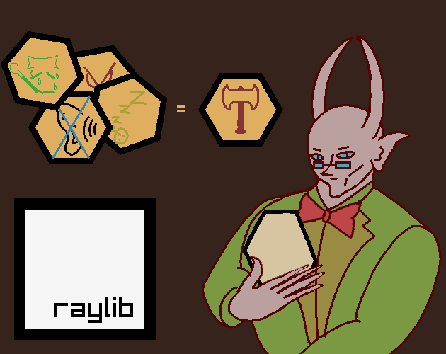
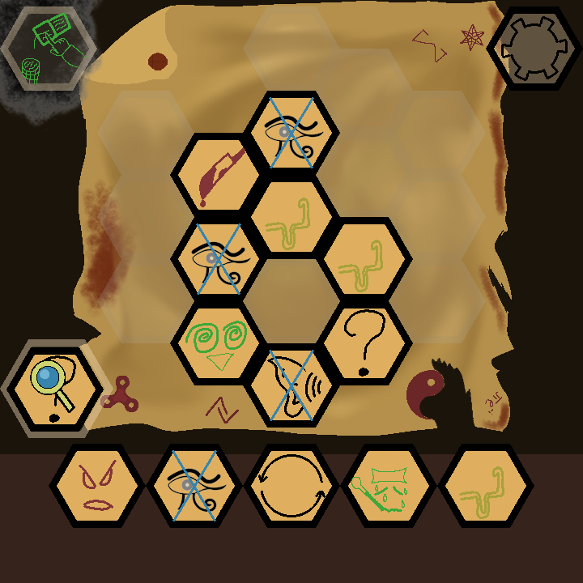
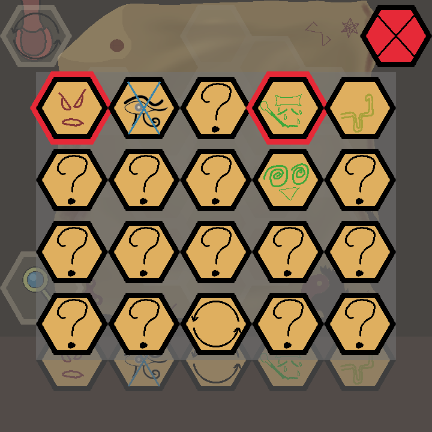
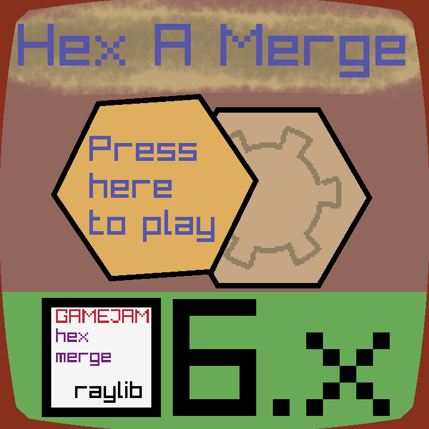
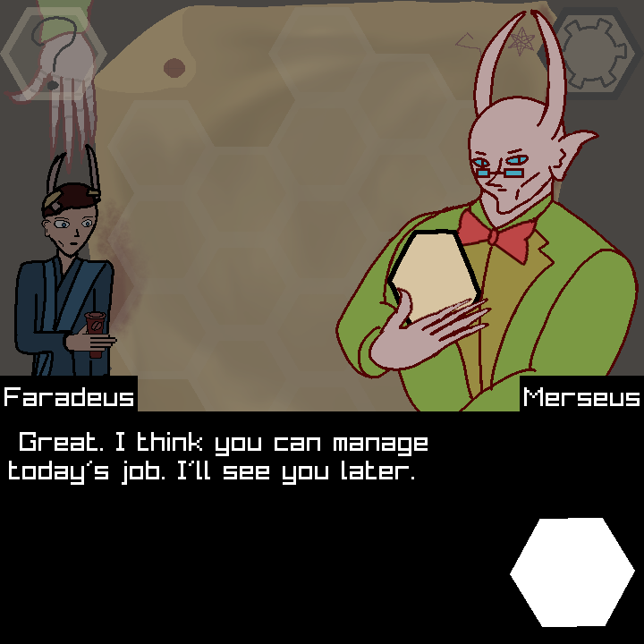
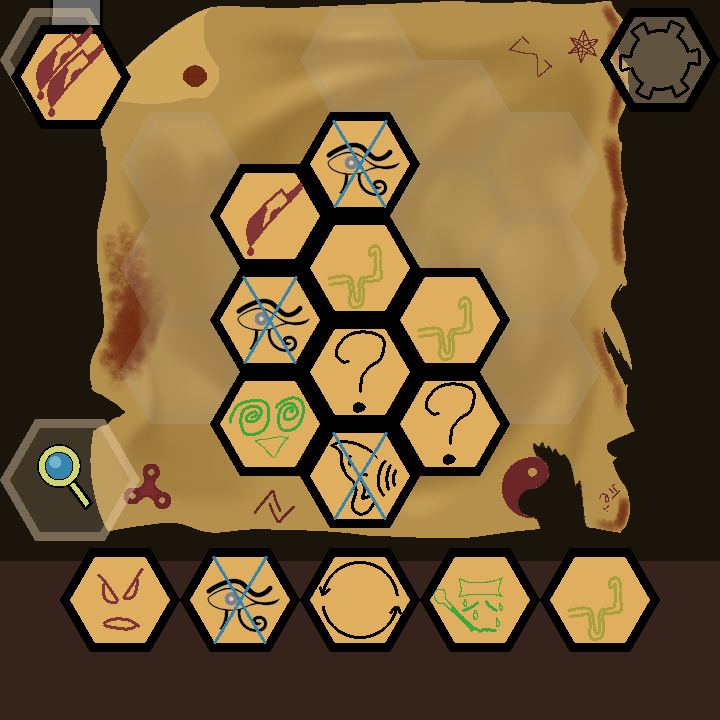
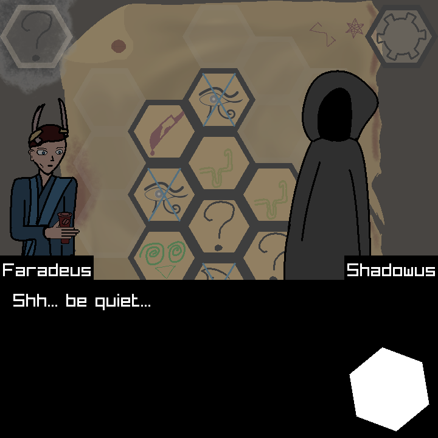
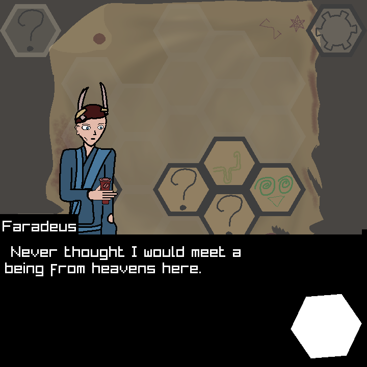

## Hex a merger

### Description

In this game you play as a hex seller in hell. You have to merge Hexes (kinds of curses) to sell them to your customers!

### Features

 - Settings (music volume control)
 - Story
 - Gameplay

### Controls

Mouse and touch:
 - Tap on buttons.
 - During gameplay drag and drop hexagons in their places. You can also drag and drop them to inspection menu that will show what that hexagon is made of.

### Screenshots

### Developers

 - Bobon4uto - coding and drawing

### Links

 - YouTube Gameplay: https://youtu.be/e33u5_K1584
 - itch.io Release: 
<iframe frameborder="0" src="https://itch.io/embed/4753497" width="552" height="167"><a href="https://bobon4uto.itch.io/hex-a-merger">hex a merger by bobon4uto</a></iframe>

### License

This project sources are licensed under an unmodified zlib/libpng license, which is an OSI-certified, BSD-like license that allows static linking with closed source software. Check [LICENSE](LICENSE) for further details.

*Copyright (c) 2026 Vladimir Petrenko (@bobon4uto)*
