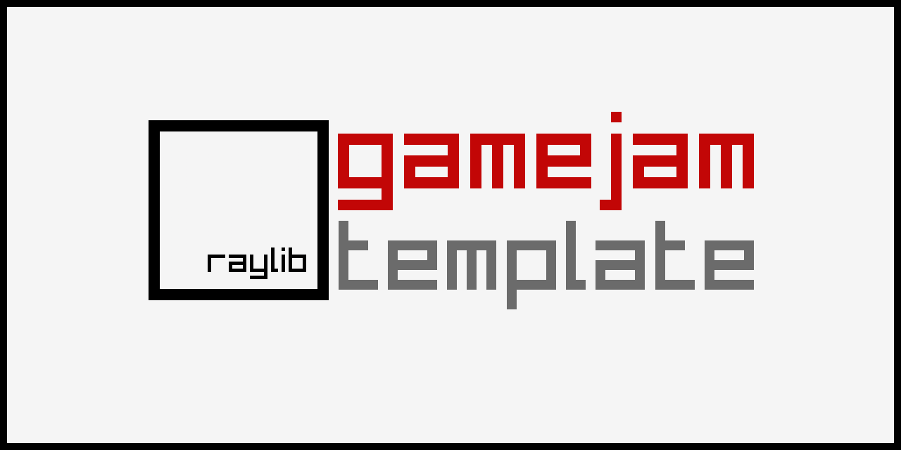

## Hex a merger

### Description

In this game you play as a hex seller in hell. You have to merge Hexes (kinds of curses) to sell them to your customers!

### Features

 - Settings (mainly music volume control)
 - Story
 - Gameplay

### Controls

Mouse and touch:
 - Tap on buttons.
 - During gameplay drag and drop hexagons in their places. You can also drag and drop them to inspection menu that will show what that hexagon is made of.

### Screenshots

TBD

### Developers

 - Bobon4uto - coding

### Links

 - YouTube Gameplay: TBD
 - itch.io Release: TBD

### License

This project sources are licensed under an unmodified zlib/libpng license, which is an OSI-certified, BSD-like license that allows static linking with closed source software. Check [LICENSE](LICENSE) for further details.

*Copyright (c) 2026 Vladimir Petrenko (@bobon4uto)*
